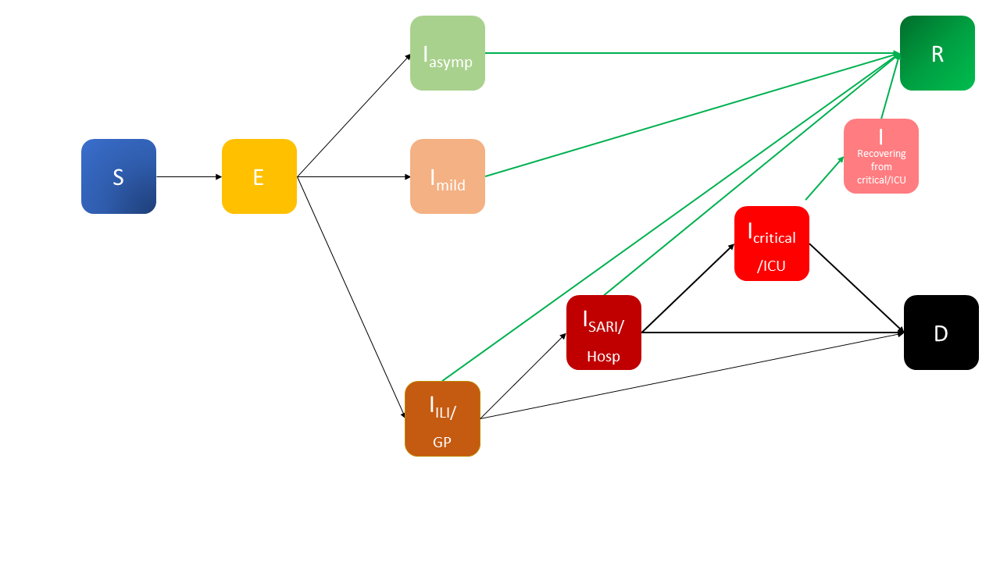

# epiabm
[](https://github.com/SABS-R3-Epidemiology/epiabm/actions/workflows/unit-tests.yml)
[](https://github.com/SABS-R3-Epidemiology/epiabm/actions/workflows/cpp-unit-tests-ubuntu.yml)
[](https://epiabm.readthedocs.io/en/latest/?badge=latest)
[](https://codecov.io/gh/SABS-R3-Epidemiology/epiabm)

## General Information

This programme implements a SEIR based model with added spatial complexity. It immitates the Imperial CovidSim model, but aims to simplify and clarify the model by using more user friendly software practices. It also provides various sub-models (with elements of the CovidSim model removed) for research and pedagogical investigation into the effect of different aspects of the model.

## Model Summary

The model contains two main sections: transmission mechanisms and within host progression.

For each timestep the code loops through the population and records interations between infected and susceptible people which may lead to infections. Individuals are allocated a susceptibility based on age and location data and pairs of individuals considered to see whether their interaction leads to infection. The likelihood of a pair interacting is weighted by spatial distance and age factors (as people are more likely to socialise with those of the same age, and children maintain close contact with parents). This incorporates the major spatial variation within the model.
 
Once an individual becomes exposed, their progression through the various stages of infection is determined by generating a series of random timesteps to mark their movements between infection categories. The possible paths an individual can take are indicated on the schema below.



A more complete overview of our implementation of the Ferguson model is given in [the Wiki](https://github.com/SABS-R3-Epidemiology/epiabm/wiki/Overview-of-the-Ferguson-Model) for this repository.

## pyEpiabm
The pyEpiabm backend is written in python, chosen for its readability and user-friendliness. It is not able to cope with large population sizes, but can configure a toy population to explore the functionality of the model and better understand the underlying code. Additionally, toy models may be quicker for model comparison and parameter inference, though care should obviously be taken when scaling up to a full population. We provide a variety of workflows to show the utility of code.


## cEpiabm
We also provide an efficient and scalable backend in C++, which can run simulations for populations comparable to the UK in a reasonable timeframe. This code may be harder for new users to understand, but the parallels with the python code should be sufficiently informative for those who wish to look deeper into the code.

## Set up
### Installation of cEpiabm

Cmake is used for installation of the cEpiabm software. The following procedure will compile the code and run all unit tests:
```
mkdir build_dir
cd build_dir
cmake ../cEpiabm/. -DCMAKE_BUILD_TYPE=Debug
cmake --build . --parallel 2 --target unit_tests
ctest -j2 --output-on-failure
```
Note that cmake must be installed on your system. The following command can be used on ubuntu systems:
```
sudo apt-get install cmake cmake-data
```

## Documentation 
Documentation on the python backend (pyEpiabm) is stored on [Read The Docs](https://epiabm.readthedocs.io/en/latest/).  
The Wiki for this repo also contains more detail on the Ferguson model itself, and where our implementation might differ from that.

## References
List of resources that can be useful for the project:
* Ferguson N, 2020. Impact  of  non-pharmaceutical  interventions (NPIs) to reduce COVID-19 mortality and healthcare demand (https://www.imperial.ac.uk/media/imperial-college/medicine/sph/ide/gida-fellowships/Imperial-College-COVID19-NPI-modelling-16-03-2020.pdf)
* Gillespie D, 1977. Exact stochastic simulation of coupled chemical reactions (https://doi.org/10.1021/j100540a008)
* Erban R, Chapman J and Maini P, 2007. A practical guide to stochastic simulations of reaction-diffusion processes (https://arxiv.org/abs/0704.1908)
* Bauer F, 2008. Compartmental models in epidemiology (https://link.springer.com/chapter/10.1007/978-3-540-78911-6_2).
