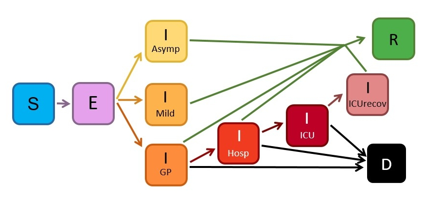

# epiabm

[](https://github.com/SABS-R3-Epidemiology/epiabm/actions/workflows/unit-tests.yml)
[](https://github.com/SABS-R3-Epidemiology/epiabm/actions/workflows/cpp-unit-tests-ubuntu.yml)
[](https://epiabm.readthedocs.io/en/latest/?badge=latest)
[](https://codecov.io/gh/SABS-R3-Epidemiology/epiabm)

## General Information

This programme implements an agent-based SEIR model with added compartments and spatial complexity. It imitates the Imperial CovidSim model, but aims to simplify and clarify the model by using more user friendly software practices. It also provides various sub-models (with elements of the CovidSim model removed) for research and pedagogical investigation into the effect of different aspects of the model.

## Model Summary

The model contains two main sections: transmission mechanisms and within host progression.

For each timestep the code loops through the population and records interactions between infected and susceptible people which may lead to infections. Individuals are allocated a susceptibility based on age and location data and pairs of individuals considered to see whether their interaction leads to infection. The likelihood of a pair interacting is weighted by spatial distance and age factors (as people are more likely to socialise with those of the same age, and children maintain close contact with parents). This incorporates the major spatial variation within the model.

Once an individual becomes exposed, their progression through the various stages of infection is determined by generating a series of random timesteps to mark their movements between infection categories. The possible paths an individual can take are indicated on the schema below.



A more complete overview of our implementation of the Ferguson model is given in [the Wiki](https://github.com/SABS-R3-Epidemiology/epiabm/wiki/Overview-of-the-Ferguson-Model) for this repository.

# pyEpiabm

The pyEpiabm backend is written in python, chosen for its readability and user-friendliness. It is not able to cope with large population sizes, but can configure a toy population to explore the functionality of the model and better understand the underlying code. Additionally, toy models may be quicker for model comparison and parameter inference, though care should obviously be taken when scaling up to a full population. We provide a variety of workflows to show the utility of code.

## Installation of pyEpiabm

pyEpiabm is not yet avaliable on [PyPI](https://pypi.org/), but the module can be pip installed locally. The directory should first be downloaded to your local machine, and can then be installed using the command:

```console
pip install -e .
```

from the `pyEpiabm` directory. If you also wish to build the docs locally, this requires additional dependencies, which must be specified:

```console
pip install -e .[docs]
```

## Running a simulation

A complete workflow for running a simulation is provided in `python_examples/simulation_flow.py`. There are a number of steps to this process:

### Set Random Seed _(Optional)_

This allows the random seed to be set for all random modules used in the simulation, to enable reproducible simulations. The recommended approach here is to set one seed at the start of the script (before configuring the population or the simulation objects), so that both are generated according to this seed. It is also possible to set a separate seed for one or other object, by passing `population_seed` or `simulation_seed` into their respective parameter dictionaries, however care should be exercised to ensure the two objects are configured sequentially. For example, generating a second population after setting the simulation seed would be done according to `simulation_seed` not `population_seed`. Setting the seed is not currently compatible with multi-threaded execution.

### Configure Population

Create a population based on the parameters given, from the following list:

* `population_size`: Number of people in population
* `cell_number`: Number of cells in population
* `microcell_number`: Number of microcells in each cell
* `household_number`: Number of households in each microcell _(Optional)_
* `place_number`: Number of places in each microcell _(Optional)_
* `population_seed`: Random seed for reproducible populations - see above _(Optional)_

### Import Population

Alternatively, it is possible to import a population from a `.csv` file, with the following headings:

* `cell`: ID code for cell
* `microcell`: ID code for microcell
* `location_x`: The x coordinate of the parent cell location
* `location_y`: The y coordinate of the parent cell location
* `household_number`: Number of households in that microcell
* Any number of columns with titles from the `InfectionStatus`
    enum (such as `InfectionStatus.Susceptible`), giving the
    number of people with that status in that cell

File of this format can also be exported using the `pyEpiabm.routine.FilePopulationConfig.print_population()` method, i.e. for reproducibility or use in further simulations.

### Configure Simulation

Configure a simulation with a number of parameters. These are split into two categories:

*`sim_params`* _(For running the simulation)_
* `simulation_start_time`: The initial time at the start of the simulation
* `simulation_end_time`: The final time at which to stop the simulation
* `initial_infected_number`: The initial number of infected individuals in the population
* `initial_infect_cell`: Whether to choose initial infected individuals from a single cell
* `simulation_seed`:  Random seed for reproducible simulations - see above _(Optional)_

*`file_params`* _(For controlling output location)_
* `output_file`: String for the name of the output .csv file
* `output_dir`: String for the location of the output file, as a relative path
* `spatial_output`: Boolean to determine whether a spatial output should be used _(Default false)_

Two lists of sweeps must also be passed to this function - the first will be executed once at the start of the simulation (i.e. to determine the initial infections in the population), while the second list will be ran at every timestep (i.e. to propagate the infection through the population).

## PyEpiabm Documentation

Documentation on the python backend (pyEpiabm) is stored on [Read The Docs](https://epiabm.readthedocs.io/en/latest/).  
The Wiki for this repo also contains more detail on the Ferguson model itself, and where our implementation might differ from that.

# cEpiabm

We also provide an efficient and scalable backend in C++, which can run simulations for populations comparable to the UK in a reasonable timeframe. This code may be harder for new users to understand, but the parallels with the python code should be sufficiently informative for those who wish to look deeper into the code.

## Set up

### Installation of cEpiabm

Cmake is used for installation of the cEpiabm software. The following procedure will compile the code and run all unit tests:

```console
mkdir build_dir
cd build_dir
cmake ../cEpiabm/. -DCMAKE_BUILD_TYPE=Debug
cmake --build . --parallel 2 --target unit_tests
ctest -j2 --output-on-failure
```

Note that cmake must be installed on your system. The following command can be used on ubuntu systems:

```console
sudo apt-get install cmake cmake-data
```

## CEpiabm Documentation

Documentation on the C++ backend (cEpiabm) is stored on [Read The Docs](https://cepiabm.readthedocs.io/en/latest/).

# References

List of resources that can be useful for the project:

* Knock E et al., 2021. Key epidemiological drivers and impact of interventions in the 2020 SARS-CoV-2 epidemic in England (https://www.science.org/doi/epdf/10.1126/scitranslmed.abg4262)
* Ferguson N, 2020. Impact  of  non-pharmaceutical  interventions (NPIs) to reduce COVID-19 mortality and healthcare demand (https://www.imperial.ac.uk/media/imperial-college/medicine/sph/ide/gida-fellowships/Imperial-College-COVID19-NPI-modelling-16-03-2020.pdf)
* Bauer F, 2008. Compartmental models in epidemiology (https://link.springer.com/chapter/10.1007/978-3-540-78911-6_2)
* Erban R, Chapman J and Maini P, 2007. A practical guide to stochastic simulations of reaction-diffusion processes (https://arxiv.org/abs/0704.1908)
* Ferguson N et al., 2006. Strategies for mitigating an influenza pandemic (https://pubmed.ncbi.nlm.nih.gov/16642006/)
* Gillespie D, 1977. Exact stochastic simulation of coupled chemical reactions (https://doi.org/10.1021/j100540a008)
