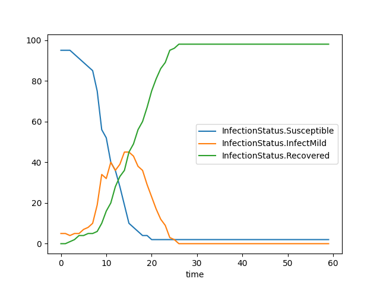

# Python Examples

This directory contains a number of examples of python workflows to run simulations with pEpiabm. New users are suggested to use the `simulation_flow.py` script to run a basic simulation with little initial configuration. More complex examples are given in subdirectories of this folder.

## Simulation Flow

This script outlines all commands necessary to run a basic simulation. It models a population of 100 individuals, spread across 20 households in a single cell and microcell.

It subsequently saves the results to a .csv file, and plots a basic SIR plot of the simulation output, depicted below:

## Spatial Simulations

Contained within the `spatial_example/` directory, this script runs a basic simulation with spatial dependance. It considers a population of 1000 individuals, spread across 40 households in 20 cells, each with a single microcell.

It subsequently saves the results to a .csv file, and plots the infection curve for each region. There is currently no differentiation between cells, and so any variation is due to random fluctuations. Any null curves are because there were no infectious individuals seeded in that cell, and no inter-cellular infection mechanisms are currently implemented.

We also provide a script (`voronoi_plotting_example.py`) for visualising the spatial distribution of the epidemic, generating cells based on a single location coordinate using [Voronoi Tesselation](https://en.wikipedia.org/wiki/Voronoi_diagram).

## CovidSim Comparision

The `gibraltar_simulation_flow.py` script runs a simulation of the spread of coronavirus across Gibraltar - a country chosen for its small size (and hence ease of simulation) while having complete [simulation parameters](https://github.com/mrc-ide/covid-sim/blob/master/data/admin_units/Gibraltar_admin.txt) available on the repo for [CovidSim](https://github.com/mrc-ide/covid-sim). Microcell-wise locations are not specified directly, and so reconstructed using the `microcell.conversion.py` script to generate the `gib_input.csv` file used in the main simulation flow.
