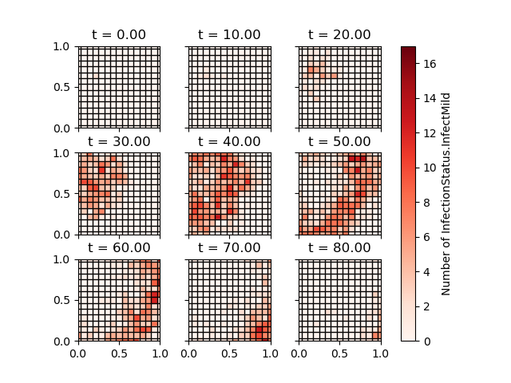
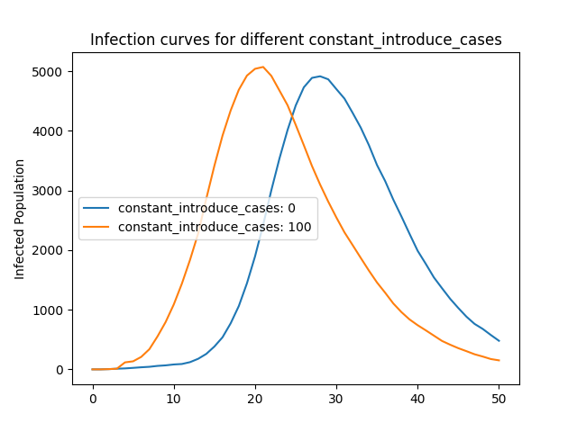

# Python Examples

This directory contains a number of examples of python workflows to run simulations with pyEpiabm. New users are suggested to use the `basic_example/simulation_flow.py` script to run a basic simulation with little initial configuration. More complex examples are given in subdirectories of this folder.

## Basic Example

This script outlines all commands necessary to run a basic simulation. It models a population of 100 individuals, spread across 20 households in a single cell and microcell.

It subsequently saves the results to a .csv file, and plots a basic SIR plot of the simulation output, depicted below:

## Spatial Simulations

Contained within the `spatial_example/` directory, this script runs a basic simulation with spatial dependance. It considers a population of 1000 individuals, spread across 40 households in 20 cells, each with a single microcell.

It subsequently saves the results to a .csv file, and plots the infection curve for each region. There is currently no differentiation between cells, and so any variation is due to random fluctuations. Any null curves are because there were no infectious individuals seeded in that cell, and no inter-cellular infection mechanisms are currently implemented.

We also provide a script (`voronoi_plotting_example.py`) for visualising the spatial distribution of the epidemic, generating cells based on a single location coordinate using [Voronoi Tesselation](https://en.wikipedia.org/wiki/Voronoi_diagram).

## Age Stratified Simulation

Contained within the `age_stratified_example/` directory, this script creates an age stratified population, and runs a basic simulation with no spatial component. Output is again written to as .csv file. A helper function, `age_stratified_plot` is used to reformat the output csv to find total daily cases (which can be saved to a separate .csv), and create a bar chart coloured by age category of these results. 

## Intervention Examples
Contained within the `intervention_example/` directory, these scripts runs simulations in which one intervention is active. Output graphs are contained within the `intervention_example/intervention_outputs/` directory. All simulations are run using the same input file containing a population of 10000 individuals, spread across 200 cells, each with 2 microcells, and 5 households per microcell. Simulations are run until day 50 with one initial infection. Of all interventions only Social Distancing, Vaccination, and Travel Isolation use age in the model. All interventions consider household, place and spatial infections. Unless mentioned otherwise, intervention parameters are set to the CovidSim parameters (file p_PC7_CI_HQ_SD.txt).

### Case Isolation
The resulting infection curve shows the progression of the disease when symptomatic infected cases isolate with different isolation probabilities. Infection curves when none of the symptomatic individuals isolate ('isolation_probability' equals 0.0), half of the symptomatic individuals isolate ('isolation_probability' equals 0.5), and all symptomatic individuals isolate ('isolation_probability' equals 1.0) are compared. The case isolation will last for 10 days. Increasing the isolation probability results in a delayed wave with reduced peak of infections.

### Household Quarantine
The resulting infection curve shows the progression of the disease when the household of the case isolating individual enters quarantine. Infection curves when none of the individuals in the household enters quarantine ('quarantine_house_compliant' equals 0.0), half of the individuals in the household enters quarantine ('quarantine_house_compliant' equals 0.5), and all individuals in the household enters quarantine ('quarantine_house_compliant' equals 1.0) are compared (as 'quarantine_individual_compliant' and 'quarantine_house_compliant' are always set to 1.0). The household quarantine will last for 14 days. Increasing the compliance of the household will reduce the peak of infections. The peak of infections with a 100% compliance is observed earlier than with a 50% compliance, as infections within a household increase when individuals isolate within their household. 

## Place Closure
The resulting infection curve shows the progression of the disease when no interventions are applied, workplaces (4place_type 4) are closed, and when workplaces and all schools (place_type 1, 2, and 3) are closed. A small decrease in the peak of infections and a slight delay in the wave peak was observed. The small change can be explained by the fact that household and spatial infections increase by closing the places ('closure_household_infectiousness' and 'closure_spatial_params' > 1.0)

## Social Distancing
The resulting infection curve shows the progression of the disease when no interventions are applied, eldery (> 60 years) socially distance, and everyone socially distance. In this simulation, social distancing will decrease the household infections ('distancing_house_enhanced_susc' equals 0.8), infections in all places ('distancing_place_enhanced_susc' set to 0.1 for all places) and spatial infections ('distancing_place_enhanced_susc' equals 0.1). Not enhanced parameters are set to 1.0 to generate a simulation in which the intervention does not have an effect. Both the invervention on only the eldery as on the whole population delayed the wave with reduced peak of infections. Applying the intervention on the total population had the strongest effect. 

## Vaccination
The resulting infection curve shows the progression of the disease without interventions, when 50% of the population takes a vaccin, and when everyone takes a vaccin. With a vaccin an individual is protected for 80% ('vacc_protectiveness') against the disease. Results showed a delayed wave with a reduced peak of infections when (a part of) the population is infected. 

## Disease Testing
The resulting infection curve shows the progression of the disease without interventions compared to case isolating every individual that test positive. Testing (unlimited 'testing_capacity') is performed on every individual that is symptomatic and on half the population of asymptomatic individuals. 50% of the symptomatic individuals get a PCR test (rest lateral flow), whereas only 20% of the asymptomatic individuals get a PCR test. Diagnositic performance is specified for both types of test. All false negative symptomatic individuals will be tested again if their severity get worse and all false negative asymptomatic individuals will be tested again when they start to develop symptoms. Results showed a delayed wave with a reduced peak of infections when individuals case isolated based on this testing strategy compared to a situation in which no interventions take place.

## Travel Isolation
The resulting infection curve shows the progression of the disease when individuals introduced by travelling isolate. Infection curves when none of the introduced individuals isolate ('isolation_probability' equals 0.0), all the introduced individuals isolate in their assigned household ('isolation_probability' equals 1.0, 'hotel_isolate' equals 0), and all the introduced individuals isolate in an isolated household in the assigned microcell ('isolation_probability' equals 1.0, 'hotel_isolate' equals 1). Isolated individuals in isolated households might enter another household after their isolation period. Isolating introduced indiviudals results in a delayed wave. A further delayed wave with reduced peak of infections is observed when the introduced individuals isolate in their own isolating household.

## Travel Example
Contained within the `travel_example/` directory, this script runs a simulation in which infected (mild or asymptomatic) enter the population. Output graphs are contained within the `travel_example/travelling_outputs/` directory. The simulation is run on a population of 10000 individuals, spread across 200 cells, each with 2 microcells, and 5 households per microcell. The simulation is run until day 50 with one initial infection, age is used in the model and household, place and spatial infections are considered.

The two resulting infection curves shows the progression of the disease when every day a ratio of the number of infected cases in the population is introduced and when a constant number of infected individuals is introduced at day 4. Infection curves when no individuals are introduced  ('ratio_introduce_cases' equals 0.0), 5% of the infected cases in the population are introduced as newly infected individuals ('ratio_introduce_cases' equals 0.05), and 10% of the infected cases in the population are introduced as newly infected individuals ('ratio_introduce_cases' equals 0.1) are compared. Introducing more infected individuals will dilate the wave with an increased peak of infections. Furthermore, not introducing individuals (constant_introduce_cases equals [0]) is compared to introducing 100 individuals at day 4. Introducing infected individuas results in an early start of the wave of infections.

## cEpiabm Example

This gives jupyter notebook examples of how to run both threaded and non-threaded simulations in `cEpiabm` from python, using the python bindings (requires pybind 11).

## Gibraltar Example

The `gibraltar_simulation_flow.py` script runs a simulation of the spread of coronavirus across Gibraltar - a country chosen for its small size (and hence ease of simulation) while having complete [simulation parameters](https://github.com/mrc-ide/covid-sim/blob/master/data/admin_units/Gibraltar_admin.txt) available on the repo for [CovidSim](https://github.com/mrc-ide/covid-sim). Microcell-wise locations are not specified directly, and so reconstructed using the `microcell.conversion.py` script to generate the `gib_input.csv` file used in the main simulation flow.
