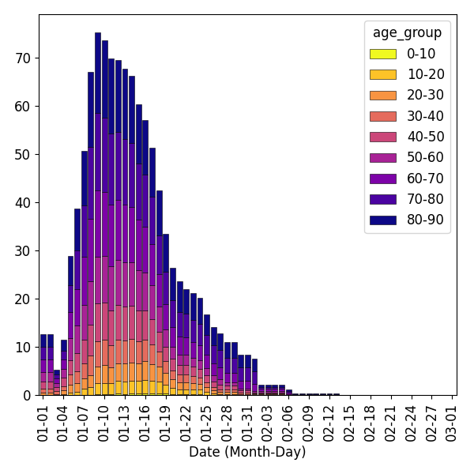

# Python Examples

This directory contains a number of examples of python workflows to run simulations with pyEpiabm. New users are suggested to use the `basic_example/simulation_flow.py` script to run a basic simulation with little initial configuration. More complex examples are given in subdirectories of this folder.

## Basic Example

This script outlines all commands necessary to run a basic simulation. It models a population of 100 individuals, spread across 20 households in a single cell and microcell.

It subsequently saves the results to a .csv file, and plots a basic SIR plot of the simulation output, depicted below:

## Spatial Simulations

Contained within the `spatial_example/` directory, this script runs a basic simulation with spatial dependance. It considers a population of 1000 individuals, spread across 40 households in 20 cells, each with a single microcell.

It subsequently saves the results to a .csv file, and plots the infection curve for each region. There is currently no differentiation between cells, and so any variation is due to random fluctuations. Any null curves are because there were no infectious individuals seeded in that cell, and no inter-cellular infection mechanisms are currently implemented.

We also provide a script (`voronoi_plotting_example.py`) for visualising the spatial distribution of the epidemic, generating cells based on a single location coordinate using [Voronoi Tesselation](https://en.wikipedia.org/wiki/Voronoi_diagram).

## Age Stratified Simulation

Contained within the `age_stratified_example/` directory, this script creates an age stratified population, and runs a basic simulation with no spatial component. Output is again written to as .csv file. A helper function, `age_stratified_plot` is used to reformat the output csv to find total daily cases (which can be saved to a separate .csv), and create a bar chart coloured by age category of these results. 

## Intervention Examples
Contained within the `intervention_example/` directory, these scripts runs simulations in which one intervention is active. Output graphs are contained within the `intervention_example/intervention_outputs/` directory. All simulations are run using the same input file containing a population of 10000 individuals, spread across 200 cells, each with 2 microcells, and 5 households per microcell. Simulations are run until day 50 with one initial infection. Of all interventions only Social Distancing and Vaccination use age in the model. All interventions consider household, place and spatial infections.

### Case Isolation
The resulting infection curve, saved to a .png file, shows the progression of the disease when symptomatic infected cases isolate with different isolation probabilities. Infection curves when none of the symptomatic individuals isolate ('isolation_probability' equals 0.0), half of the symptomatic individuals isolate ('isolation_probability' equals 0.5), and all symptomatic individuals isolate ('isolation_probability' equals 1.0) are compared. Increasing the isolation probability results in a delayed wave with reduced peak of infections.

### Household Quarantine
The resulting infection curve, saved to a .png file, shows the progression of the disease when the household of the case isolating individual enters quarantine. Infection curves when none of individuals in the household enters quarantine ('quarantine_house_compliant' equals 0.0), half individuals in the household enters quarantine ('quarantine_house_compliant' equals 0.5), and all individuals in the household enters quarantine ('quarantine_house_compliant' equals 1.0) are compared (as 'quarantine_individual_compliant' is always set to 1.0). Increasing the compliance of the household results in a delayed wave with reduced peak of infections.

## Place Closure

## Social Distancing

## Vaccination

## Disease Testing

## Travel Isolation
The resulting infection curve, saved to a .png file, shows the progression of the disease when individuals introduced by travelling isolate. Infection curves when none of the introduced individuals isolate ('isolation_probability' equals 0.0), all the introduced individuals isolate in their assigned household ('isolation_probability' equals 1.0, 'hotel_isolate' equals 0), and all the introduced individuals isolate in an isolated household in the assigned microcell ('isolation_probability' equals 1.0, 'hotel_isolate' equals 1). Isolated individuals in isolated households might enter another household after their isolation period. Isolating introduced indiviudals results in a delayed wave with reduced peak of infection. A stronger effect is observed when the introduced individuals isolate in their own isolating household.

## cEpiabm Example

This gives jupyter notebook examples of how to run both threaded and non-threaded simulations in `cEpiabm` from python, using the python bindings (requires pybind 11).

## Gibraltar Example

The `gibraltar_simulation_flow.py` script runs a simulation of the spread of coronavirus across Gibraltar - a country chosen for its small size (and hence ease of simulation) while having complete [simulation parameters](https://github.com/mrc-ide/covid-sim/blob/master/data/admin_units/Gibraltar_admin.txt) available on the repo for [CovidSim](https://github.com/mrc-ide/covid-sim). Microcell-wise locations are not specified directly, and so reconstructed using the `microcell.conversion.py` script to generate the `gib_input.csv` file used in the main simulation flow.
