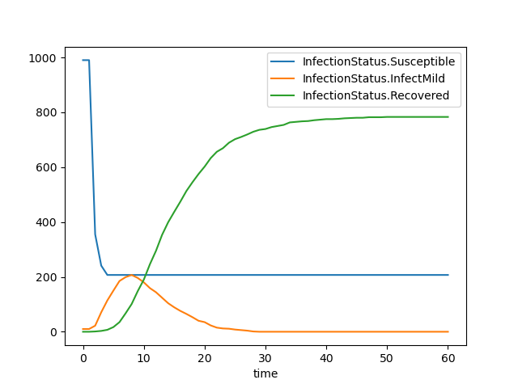
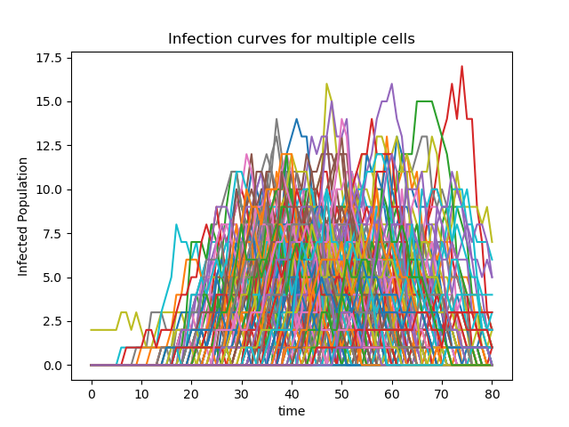
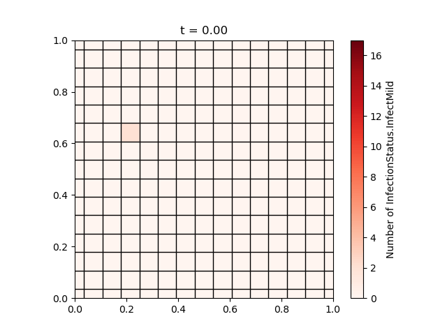

# Python Examples

This directory contains a number of examples of python workflows to run simulations with pyEpiabm. New users are suggested to use the `basic_example/simulation_flow.py` script to run a basic simulation with little initial configuration. More complex examples are given in subdirectories of this folder.

## Basic Example

This script outlines all commands necessary to run a basic simulation. It models a population of 100 individuals, spread across 20 households in a single cell and microcell. 

It subsequently saves the results to a .csv file, and plots a basic SIR plot of the simulation output, depicted below:

## Basic Infection History Simulation

Contained within the `basic_infection_history_simulation/` directory, this script runs a basic simulation. It models a population of 100 individuals, spread across 2 cells, each with 2 microcells, and 5 households per microcell.

It subsequently saves the results to .csv files. The four .csv files that are produced record the infection history of the population, the infection history of each individual, the infectiousness history of each individual, and the demographics of the population at the start of the simulation.

These .csv files are then used in the repository https://github.com/SABS-R3-Epidemiology/EpiOS.git for further analysis.

## Spatial Simulations

Contained within the `spatial_example/` directory, this script runs a basic simulation with spatial dependance. It considers a population of 10000 individuals, spread across 225 cells, each with a two microcells.

It subsequently saves the results to a .csv file, and plots the infection curve for each region. There is currently no differentiation between cells, and so any variation is due to random fluctuations. 

We also provide a script (`voronoi_plotting_example.py`) for visualising the spatial distribution of the epidemic, generating cells based on a single location coordinate using [Voronoi Tesselation](https://en.wikipedia.org/wiki/Voronoi_diagram). A [grid version](./spatial_example/spatial_outputs/voronoi_grid_img.png) of this plot is also generated.

## Age Stratified Simulation

Contained within the `age_stratified_example/` directory, this script creates an age stratified population, and runs a basic simulation with no spatial component. Output is again written to as .csv file. A helper function, `age_stratified_plot` is used to reformat the output csv to find total daily cases (which can be saved to a separate .csv), and create a bar chart coloured by age category of these results. 

## Intervention Examples

The general effect of interventions is a delayed wave with reduced peak of infections. The strenght of the intervention is dependent on the parameters. Scripts of simulations in which one intervention is active are contained within the `intervention_example/` directory. Specific examples of all interventions are shown in `intervention_example/README.md`. 

## Travel Example

Contained within the `travel_example/` directory, this script runs a simulation in which infected (mild or asymptomatic) enter the population. Output graphs are contained within the `travel_example/travelling_outputs/` directory. The simulation is run on a population of 10000 individuals, spread across 200 cells, each with 2 microcells, and 5 households per microcell. The simulation is run until day 50 with one initial infection, age is used in the model and household, place and spatial infections are considered.

The two resulting infection curves shows the progression of the disease when every day a ratio of the number of infected cases in the population is introduced and when a constant number of infected individuals is introduced at day 4. Infection curves when no individuals are introduced  ('ratio_introduce_cases' equals 0.0), 5% of the infected cases in the population are introduced as newly infected individuals ('ratio_introduce_cases' equals 0.05), and 10% of the infected cases in the population are introduced as newly infected individuals ('ratio_introduce_cases' equals 0.1) are compared. Introducing more infected individuals will dilate the wave with an increased peak of infections. Furthermore, not introducing individuals ('constant_introduce_cases' equals [0]) is compared to introducing 100 individuals at day 4. Introducing infected individuas results in an early start of the wave of infections.

## Model Population Examples

Contained within the `model_population_example/` directory, the `model_population.ipynb` notebook shows examples on how to create an uniform population file and how to run simulations on this model population. The example compares infection curves for different grid sizes (the input is stored in the `model_population_example/simulation_outputs/` directory). The generated uniform population files are stored in the `model_population_example/uniform_inputs/` directory. 

The `model_population_example/model_interventions.ipynb` notebook shows examples on how to run a simulation on a generated uniform population in which one or multiple intervention are active. The input for the multi-intervention example are stored in the `model_population_example/simulation_outputs/multi_interventions` directory.

## cEpiabm Example

This gives jupyter notebook examples of how to run both threaded and non-threaded simulations in `cEpiabm` from python, using the python bindings (requires pybind 11).

## Gibraltar Example

The `gibraltar_simulation_flow.py` script runs a simulation of the spread of coronavirus across Gibraltar - a country chosen for its small size (and hence ease of simulation) while having complete [simulation parameters](https://github.com/mrc-ide/covid-sim/blob/master/data/admin_units/Gibraltar_admin.txt) available on the repo for [CovidSim](https://github.com/mrc-ide/covid-sim). Microcell-wise locations are not specified directly, and so reconstructed using the `microcell.conversion.py` script to generate the `gib_input.csv` file used in the main simulation flow.

## Luxembourg Example

The `luxembourg_simulation_flow.py` script runs a series of 10 differently seeded simulation of the spread of coronavirus across Luxembourg. This can be run for cases with and without interventions by changing between the `luxembourg_parameters.json` and `luxembourg_intervention_parameters.json` files. The initial infections are selected to be 5 individuals in the cell number 1664 which is towards the furthest eastern part of Luxembourg near the border with Germany (6.400&deg N, 49.708&deg W). The urban and rural locations selected, Luxembourg city and Nommern, respectively, are both 180 km from this initial infection site as the crow flies, allowing for fair comparisons to be made. These initial condition can be changed to randomly seeded initial conditions by changing the `luxembourg_adapted_5_in_cell_input.csv` input file to `luxembourg_input_file.csv` and changing the "initial_infected_number" parameter to be the desired number of infections. Outputs of the simulation are stored in large csv files named `population_output_simulation_i.csv` where i is the initial simulation repeat number. 

The Jupyter Notebook rural_v_urban.ipynb shows the analysis we have done on these outputs. Including comparing that the spatial change made for version 1.1.1. The file `luxembourg_flow.py` was run on version 1.0.1 of epiabm with outputs saved as `pre_population_output_simulation_i.csv` to show the effect of the spatial change in version 1.1.1. This notebook also contains conparisons on version 1.1.1 with and without the presence of interventions. The files with interventions have their outputs stored as `population_output_intervention_simulation_i.csv` which are compared to the outputs without interventions `population_output_simulation_i.csv`.

## New Zealand Example

The `NZ_flow.py` script runs a simulation of the spread of coronavirus across New Zealand - a country chosen for its rapid implementation of strict intervention strategies to successfully control the spread of COVID-19 in the early stages of the pandemic. The parameter values for non-pharmaceutical interventions (`NewZealand_parameters.json`) are based on instructions from the New Zealand government as far as possible, based on the timeline of Alert Level changes, which documents the dates of key events and the duration of the State of National Emergency ([New Zealand Covid-19 Instructions](https://covid19.govt.nz/about-our-covid-19-response/history-of-the-covid-19-alert-system/)). Besides, one new infected case is introduced by international travel every day, and 25\% of these arrivals stay in an existing household, with the remaining staying in a hotel. 

## Sim Speeds Example

In this folder we show the improvements in the speed of pyEpiabm between version 1.0.1 and 1.1.1. These improvements were acheived by profiling and optimising the code. The Jupyter Notebook `sim_speeds.ipynb` reads in the csv files `old_intervention_basic_speeds.csv` and `old_intervention_spatial_speeds.csv` run on version 1.0.1 of pyEpiabm using the python scripts `sim_runner.py` and `sim_runner_spatial.py`. These outputs are compared to the speed of the code for version 1.1.1 in `sim_speeds.ipynb` showing the vast increase in the speed of the code and therefore its efficiency
