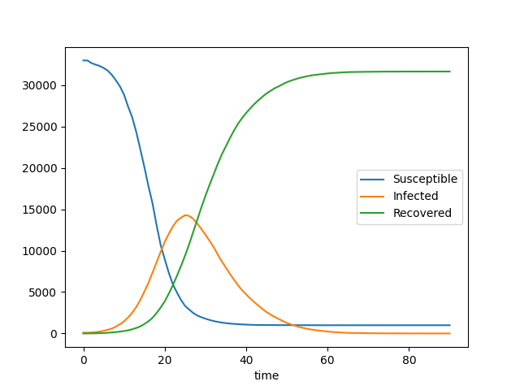
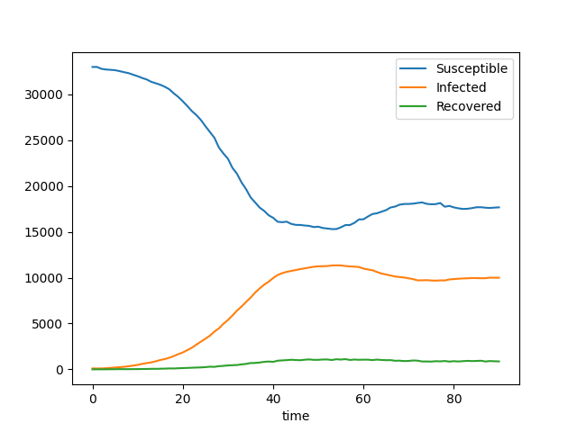

# Gibraltar Examples
Contained within the gibraltar_example/ directory, these scripts run simulations in which intervention is active or inactive in Gibraltar. Output graphs are contained within the gibraltar_example/simulation_outputs/ directory. Both simulations are run using the same input file, considering the actual population set-up in Gibraltar. 

## Without Intervention
The resulting infection curve shows the progression of the disease when the intervention is absent. The infection peak occurs around Day 25 with roughly 17k infected individuals. After the simulation there are roughly equal numbers of susceptible and infected individuals.

## With Intervention
The intervention conducted in our simulation is in line with the real instructions during the pandemic (https://www.gibraltar.gov.gi/press/covid-19-press-releases?year=2020&np=6). All interventions (i.e. case isolation, place closure, household quarantine, social distancing) start from the first day of the simulation, and most of them last for the entire simulation, except place closure, which ends at Day 74. 90% of the symptomatic individuals are self isolated, 75% of the households are compliant with household quarantine, and all forms of schools are closed during this time. These interventions affect the house, place and spatial effectiveness to different extents, and the exact values are derived from CovidSim.

The infection peak occurs around 25 days later than without the intervention, and the number of infected individuals is below 12.5k. As a result, there are far more susceptible individuals in the intervention case, which still has almost 17.5k after the simulation.

