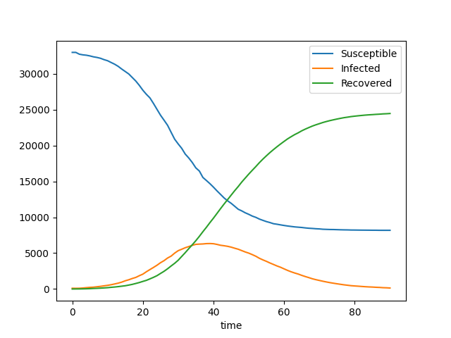

# Gibraltar Examples
Contained within the gibraltar_example/ directory, these scripts runs simulations in which intervention is active or inactive in Gibraltar. Output graphs are contained within the gibraltar_example/simulation_outputs/ directory. Both simulations are run using the same imput file, considering the real population set up in Gibraltar. 

## Without Intervention
The resulting infection curve shows the progression of the disease when the intervention is absent. The infection peak occurs around Day 40 with roughly 5k infected individuals. Nearly half of the population will be susceptible in 90 days and half of the population is recovered.

## With Intervention
The intervention conducted in our simulation is in line with the real instructions during the pandemic (https://www.gibraltar.gov.gi/press/covid-19-press-releases?year=2020&np=6). All interventions (i.e. case isolation, place closure, household quarantine, social distancing) start from the first day of simulation, and most of them lasts for the entire simulation, except place closure ends at Day 74. 90% of the symptimatic individuals are self isolated, 75% of the household are compliant to household quarantine and all forms of schools are closed during this time. These interventions affect the house, place and spacial effectiveness to different extent, that the exact values are derived from CovidSim.

The infection peak occurs 20 days earlier than without the intervention and the number of infected and recovered individuals are both below 5k. As a result, there are far more susceptible individuals in the intervention case, which still has 30k after the simulation.

