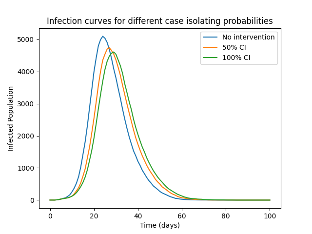
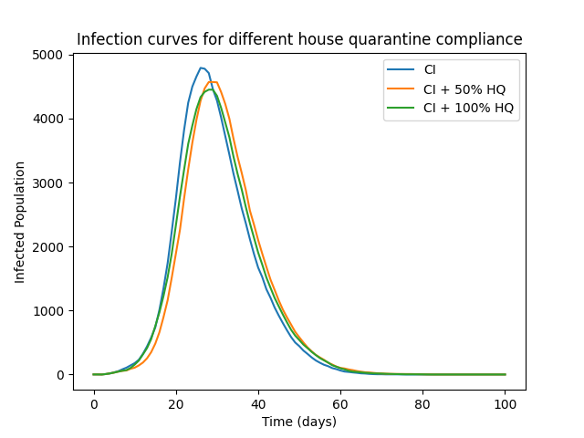
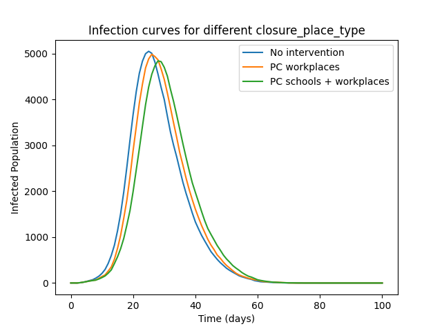
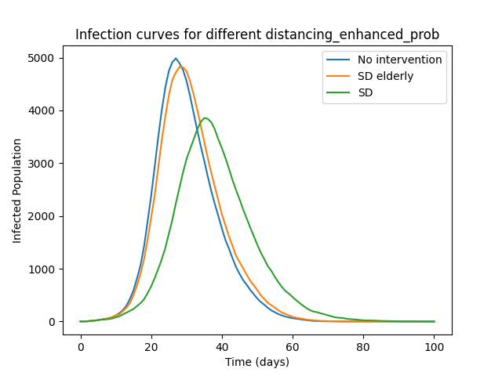
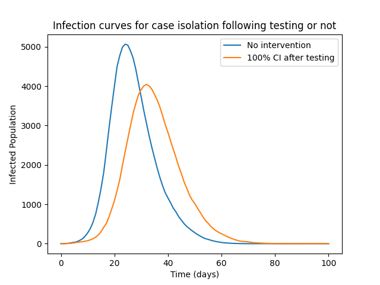

# Intervention Examples

Contained within the `intervention_example/` directory, these scripts runs simulations in which one intervention is active. Output graphs are contained within the `intervention_example/intervention_outputs/` directory. All simulations are run using the same input file containing a population of 10000 individuals, spread across 200 cells, each with 2 microcells, and 5 households per microcell. Simulations are run until day 100 with one initial infection. Of all interventions only Social Distancing, Vaccination, and Travel Isolation use age in the model. All interventions consider household, place and spatial infections. Unless mentioned otherwise, intervention parameters are set to the CovidSim parameters (file `p_PC7_CI_HQ_SD.txt`).

## Case Isolation

The resulting infection curve shows the progression of the disease when symptomatic infected cases isolate with different isolation probabilities. Infection curves when none of the symptomatic individuals isolate ('isolation_probability' equals 0.0), half of the symptomatic individuals isolate ('isolation_probability' equals 0.5), and all symptomatic individuals isolate ('isolation_probability' equals 1.0) are compared. The case isolation will last for 10 days. Increasing the isolation probability results in a delayed wave with reduced peak of infections.

## Household Quarantine

The resulting infection curve shows the progression of the disease when the household of the case isolating individual enters quarantine. Infection curves when none of the individuals in the household enters quarantine ('quarantine_house_compliant' equals 0.0), half of the individuals in the household enters quarantine ('quarantine_house_compliant' equals 0.5), and all individuals in the household enters quarantine ('quarantine_house_compliant' equals 1.0) are compared (as 'quarantine_individual_compliant' and 'quarantine_house_compliant' are always set to 1.0). The household quarantine will last for 14 days. The Case Isolation intervention is consistent in all simulations. Increasing the compliance of the household will reduce the peak of infections. The peak of infections with a 100% compliance is observed earlier than with a 50% compliance, as infections within a household increase when individuals isolate within their household. 

## Place Closure

The resulting infection curve shows the progression of the disease when no interventions are applied, workplaces (4place_type 4) are closed, and when workplaces and all schools (place_type 1, 2, and 3) are closed. A small decrease in the peak of infections and a slight delay in the wave peak was observed. The small change can be explained by the fact that household and spatial infections increase by closing the places ('closure_household_infectiousness' and 'closure_spatial_params' > 1.0)

## Social Distancing

The resulting infection curve shows the progression of the disease when no interventions are applied, eldery (> 60 years) socially distance, and everyone socially distance. In this simulation, social distancing will decrease the household infections ('distancing_house_enhanced_susc' equals 0.8), infections in all places ('distancing_place_enhanced_susc' set to 0.1 for all places) and spatial infections ('distancing_place_enhanced_susc' equals 0.1). Not enhanced parameters are set to 1.0 to generate a simulation in which the intervention does not have an effect. Both the invervention on only the eldery as on the whole population delayed the wave with reduced peak of infections. Applying the intervention on the total population had the strongest effect. 

## Vaccination

The resulting infection curve shows the progression of the disease without interventions, when 50% of the population takes a vaccine, and when everyone takes a vaccine. With a vaccine an individual is protected for 80% ('vacc_protectiveness') against the disease. Results showed a delayed wave with a reduced peak of infections when (a part of) the population is infected. 

## Disease Testing

The resulting infection curve shows the progression of the disease without interventions compared to case isolating every individual that test positive. Testing (unlimited 'testing_capacity') is performed on every individual that is symptomatic and on half the population of asymptomatic individuals. 50% of the symptomatic individuals get a PCR test (rest lateral flow), whereas only 20% of the asymptomatic individuals get a PCR test. Diagnositic performance is specified for both types of test. All false negative symptomatic individuals will be tested again if their severity get worse and all false negative asymptomatic individuals will be tested again when they start to develop symptoms. Results showed a delayed wave with a reduced peak of infections when individuals case isolated based on this testing strategy compared to a situation in which no interventions take place.

## Travel Isolation

The resulting infection curve shows the progression of the disease when individuals introduced by travelling isolate. Infection curves when none of the introduced individuals isolate ('isolation_probability' equals 0.0), all the introduced individuals isolate in their assigned household ('isolation_probability' equals 1.0, 'hotel_isolate' equals 0), and all the introduced individuals isolate in an isolated household in the assigned microcell ('isolation_probability' equals 1.0, 'hotel_isolate' equals 1). Isolated individuals in isolated households might enter another household after their isolation period. Isolating introduced indiviudals results in a delayed wave. A further delayed wave with reduced peak of infections is observed when the introduced individuals isolate in their own isolating household.

